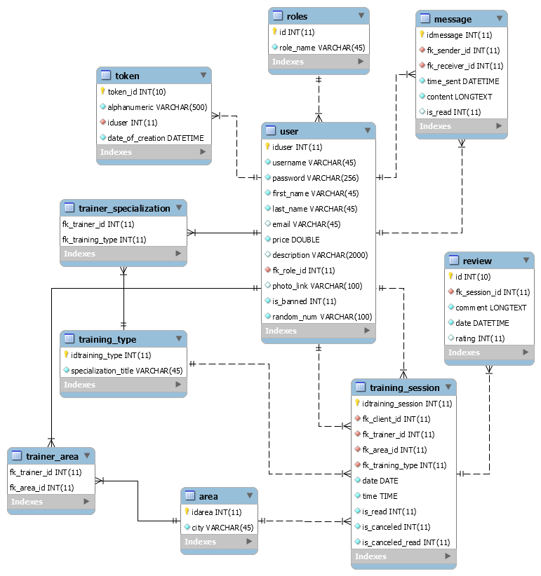

# fit.io-back-end

The back-end part of fit.io. A RESTful web application for finding personal trainers.

#### Link to the front-end part
* [fit.io front-end](https://github.com/ioiliakop/fit.io-front-end)

## Built with

* [Spring Boot 2.1.3](https://spring.io/projects/spring-boot)
* [Java 1.8](https://www.oracle.com/technetwork/java/javase/downloads/jdk8-downloads-2133151.html)
* [MySQL Community Server 8.0](https://dev.mysql.com/downloads/mysql/)

## MySQL schema used

## Information
More information about the app and it's features can be found on the [front-end part](https://github.com/ioiliakop/fit.io-front-end).
